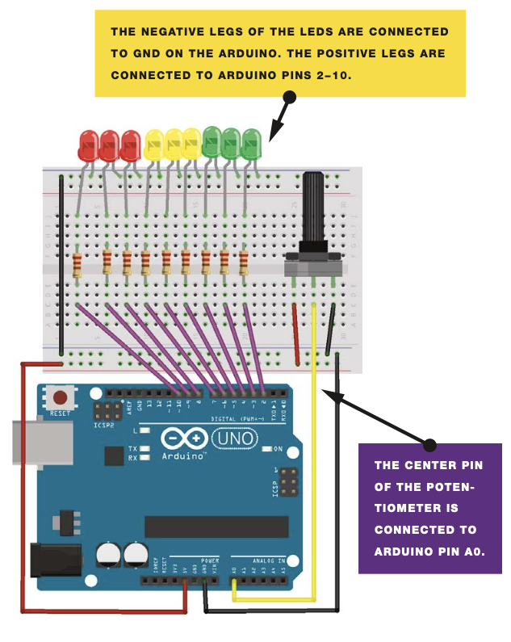
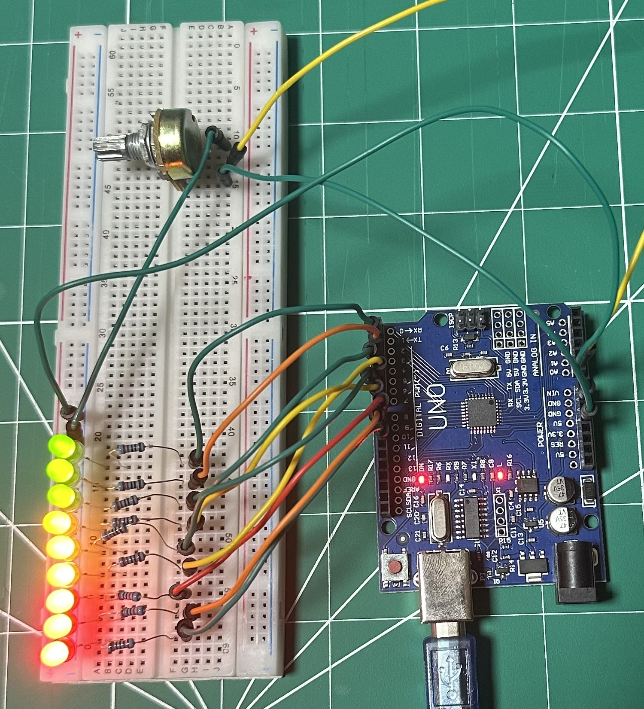

# Arduino Bar Graph Project

This project demonstrates how to control a series of LEDs based on the value read from a potentiometer, visualizing it as a bar graph. The project contains two versions: one written using the Arduino IDE with the Arduino libraries, and the other written in pure embedded C for a more low-level approach. This helps showcase both high-level and low-level approaches to embedded development using an ATmega328P microcontroller (like the one found on an Arduino Uno).

## Project Tree

```
.
├── LICENSE
├── Makefile
├── README.md
├── build
├── ino
│   └── arduino-bar-graph
│       └── arduino-bar-graph.ino
├── setup.png
├── setup2.jpg
└── src
    ├── config.h
    ├── led_control.c
    ├── led_control.h
    ├── main.c
    ├── potentiometer.c
    └── potentiometer.h
```

## Project Versions

### Arduino Library Version (`ino/arduino-bar-graph/arduino-bar-graph.ino`)

- Uses the Arduino framework, allowing for easy prototyping and rapid development.
- Controls 9 LEDs based on the analog input from a potentiometer.
- This version is ideal for beginners.

### Pure Embedded C Version (`src/`)

- A more advanced version written in pure embedded C, without using the Arduino libraries.
- Offers direct control over registers for better performance and an in-depth understanding of microcontroller operations.
- Follows embedded software development best practices, making it more suitable for those looking to expand their knowledge of low-level programming.

## Hardware Setup

- **Microcontroller**: ATmega328P (Arduino Uno)
- **LEDs**: 9 LEDs connected to pins 2 through 10
- **Potentiometer**: Analog input connected to A0
- **Resistors**: Each LED should be connected through a current-limiting resistor (220 ohms)

### Setup Pictures





## Usage Instructions

### Arduino Version

1. Open the `.ino` file in the Arduino IDE.
2. Upload the code to your Arduino Uno.
3. Connect the hardware as shown in the images.

### Embedded C Version

1. Use the provided `Makefile` to build and upload the embedded C code.
   - Run `make` to compile the project.
   - Run `make flash` to upload the code to your microcontroller.
   - Make sure to adjust the `AVRDUDE_PORT` variable in the `Makefile` to match your system's port.
2. Connect the hardware as shown in the images.

## Requirements

- **Arduino IDE** (for the `.ino` version).
- **avr-gcc toolchain** (for the embedded C version).
- **avrdude** (to flash the firmware for the embedded C version).

## License

This project is licensed under the MIT License. See the `LICENSE` file for more information.


